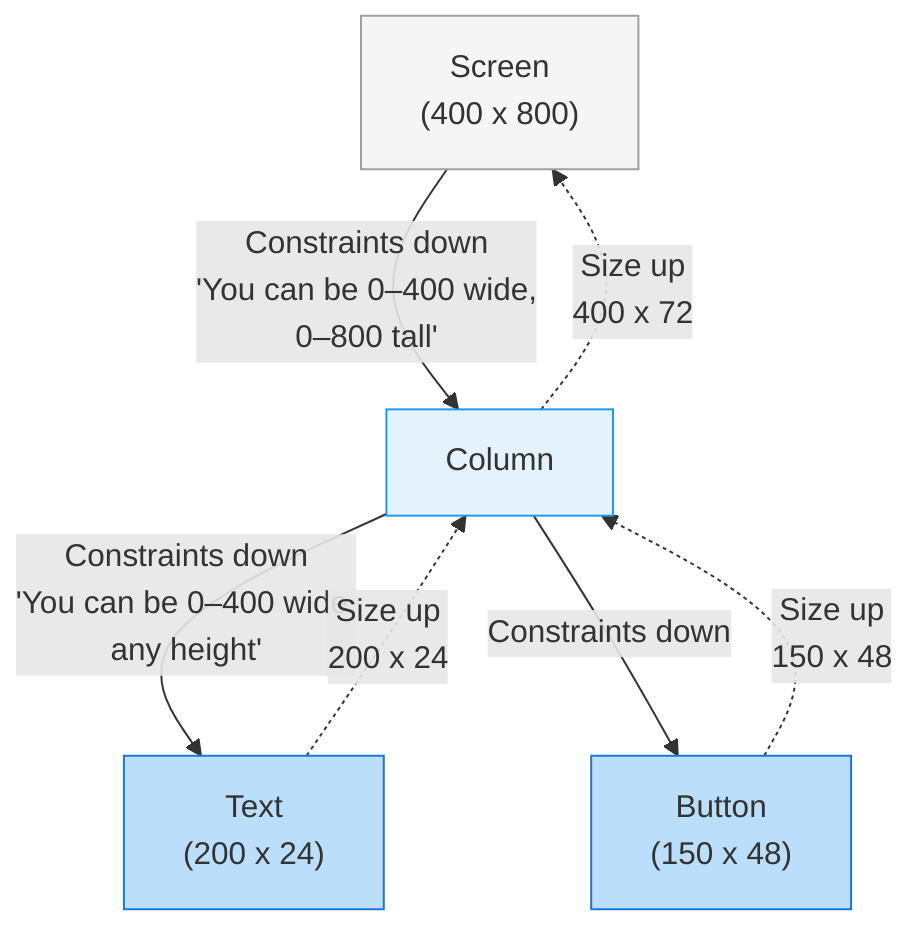
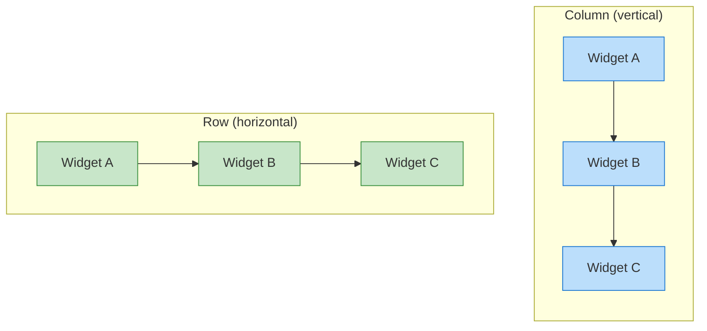
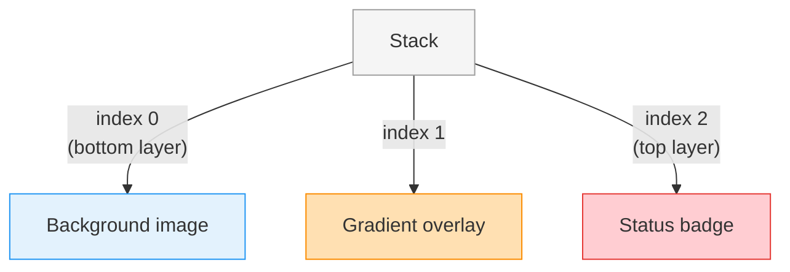
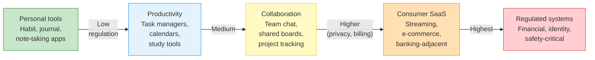
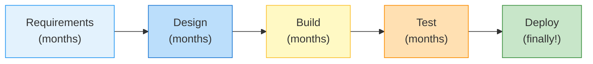
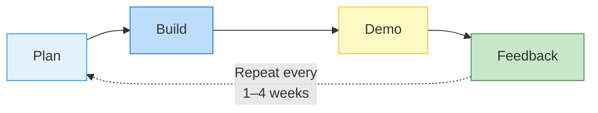

# Week 5 Lecture: Layouts, Forms, Material Design & Industry Context

**Course:** Multiplatform Mobile Software Engineering in Practice
**Duration:** ~2 hours (including Q&A)
**Format:** Student-facing notes with presenter cues

> Lines marked with `> PRESENTER NOTE:` are for the instructor only. Students can
> ignore these or treat them as bonus context.

---

## Table of Contents

1. [Flutter Layout System -- How Widgets Arrange Themselves](#1-flutter-layout-system-how-widgets-arrange-themselves-25-min) (25 min)
2. [Forms and Validation -- Getting Data from Users](#2-forms-and-validation-getting-data-from-users-20-min) (20 min)
3. [Material Design 3 -- A Design Language for Mobile Apps](#3-material-design-3-a-design-language-for-mobile-apps-15-min) (15 min)
4. [Industry Context -- The Mobile App Spectrum](#4-industry-context-the-mobile-app-spectrum-20-min) (20 min)
5. [Agile and Scrum in a Nutshell](#5-agile-and-scrum-in-a-nutshell-10-min) (10 min)
6. [Key Takeaways](#6-key-takeaways-5-min) (5 min)

---

## 1. Flutter Layout System -- How Widgets Arrange Themselves (25 min)

### From Using Widgets to Understanding Them

In Week 4, you used Column, Padding, and SizedBox to arrange widgets on screen. You wrote code like `Column(children: [...])` and things appeared vertically. It worked. But you probably also ran into a confusing overflow error at some point -- a yellow-and-black striped warning telling you that your widgets did not fit.

To prevent those errors and to build layouts that work across different screen sizes, you need to understand **how Flutter decides where to place things on screen**. This is the layout algorithm, and once you understand it, layouts stop being mysterious.

### The Constraint Model

Flutter's layout system follows three simple rules:

1. **Constraints go down.** A parent widget tells each child: "Here is how much space you have."
2. **Sizes go up.** Each child widget decides its own size within those constraints and reports back.
3. **Parent sets position.** The parent decides where to place each child on screen.

That is it. Every layout in Flutter -- from a simple centered text to a complex multi-pane dashboard -- follows these three rules.



Read this diagram from top to bottom for constraints, bottom to top for sizes. The screen says to Column: "You can be up to 400 pixels wide and 800 pixels tall." Column then tells each of its children: "You can be up to 400 pixels wide, and as tall as you want." The Text widget decides it needs 200x24 pixels. The Button decides it needs 150x48 pixels. Column adds up the heights (24 + 48 = 72), takes the maximum width (200), and reports its own size back up. Finally, Column positions the Text at the top and the Button below it.

**Analogy:** Think of it like packing a suitcase. The suitcase (parent) tells you its dimensions. You (child) choose items that fit. The suitcase does not decide how big your shirts are -- but it does decide the maximum size you can bring.

### The Overflow Error -- Demystified

When you see `A RenderFlex overflowed by 42 pixels on the bottom`, it means a child widget wanted to be bigger than its parent's constraints allowed. The child said "I need 842 pixels tall" but the parent said "You can only have 800." Flutter does not silently clip -- it paints the warning stripes so you know something is wrong.

The fix is always the same: either make the child smaller, or give it a scrollable container (like `ListView` or `SingleChildScrollView`) so it can exceed the visible area.

### Row vs Column

The most common layout widgets are `Row` (horizontal) and `Column` (vertical). They work identically -- just in different directions:



Both take a `children` list and lay them out one after another. Both support `mainAxisAlignment` (how children are distributed along the main axis) and `crossAxisAlignment` (how children are aligned perpendicular to the main axis).

### Expanded and Flexible

When a Column has leftover space, how do you tell a child to fill it? That is what `Expanded` and `Flexible` do:

- **Expanded:** "Take up all remaining space." If multiple children are `Expanded`, they share it equally (or by `flex` ratio).
- **Flexible:** "You can take up remaining space, but you do not have to." The child can be smaller than the available space.

A common pattern: a list of records takes up most of the screen, with a fixed toolbar pinned at the bottom.

```dart
Column(
  children: [
    Expanded(child: ListView(...)),   // Takes all remaining space
    BottomToolbar(),                  // Fixed height at bottom
  ],
)
```

### Stack -- Layering Widgets

`Stack` places widgets on top of each other, like layers in a graphics editor. The first child is at the bottom, the last child is on top. This is useful for overlaying badges, status indicators, or gradient overlays on images.

For example, you might overlay a "new" badge on a list card or a colored dot on a notification icon.



### ListView -- Scrollable Lists

When you have more items than fit on screen, `ListView` makes them scrollable. Unlike `Column`, `ListView` does not try to fit everything at once -- it only builds the widgets that are currently visible on screen.

For lists with many items (hundreds of rows or thousands of data points), always use `ListView.builder`. It creates items lazily, which means your app stays fast even with large datasets.

### Common Layout Patterns

Three patterns appear in nearly every data-driven mobile app:

**Dashboard with cards.** A grid or column of cards summarizing key information at a glance -- progress, totals, recent activity. Each card is a compact summary. The user's eye should be drawn to the most important value instantly.

**List of records.** A scrollable list of entries -- past activities, log entries, history items. Each item shows a summary; tapping opens the detail view.

**Detail view.** A single record shown in full -- one entry with all its fields, often with action buttons. Typically uses a Column inside a SingleChildScrollView.

> PRESENTER NOTE: Show the "Understanding Constraints" page from flutter.dev. The
> interactive examples are excellent for driving home the constraint model. If time
> allows, build a simple dashboard layout live -- a Column with three Cards, each
> showing a stat name and value. Keep it to 5 minutes max.

### Why Layout Discipline Matters

A user glancing at a summary screen must find the most important value -- the number that demands action -- instantly. If the layout is cluttered or poorly organized, the user might miss it, or worse, misread it.

Layout is not just aesthetics. The order, spacing, and emphasis of widgets directly shape how users *think* about the data they're seeing. A buried "today's total" is functionally invisible. A prominent one drives behavior.

---

## 2. Forms and Validation -- Getting Data from Users (20 min)

### Why Forms Matter

Forms are the primary way users input structured data. A user logging today's progress. A team member submitting a status update. A customer entering shipping details. Almost every app collects data through some kind of form.

In Exercise 4 last week, you built a check-in form. But it had no validation -- a user could submit with an empty name or an out-of-range value. In a real app, that corrupts your data and erodes user trust.

### TextFormField vs TextField

Flutter gives you two text input widgets:

- **TextField:** Basic text input. No built-in connection to a validation system.
- **TextFormField:** A TextField wrapped with `Form` integration. It supports a `validator` function that runs when the form is submitted.

For any app collecting structured data, prefer `TextFormField` inside a `Form`. The extra validation infrastructure pays for itself the first time a user makes a typo.

### The Form Widget and GlobalKey

The `Form` widget groups multiple `TextFormField` widgets together. A `GlobalKey<FormState>` gives you a handle to call `validate()` on all fields at once:

```dart
final _formKey = GlobalKey<FormState>();

Form(
  key: _formKey,
  child: Column(
    children: [
      TextFormField(
        validator: (value) {
          if (value == null || value.isEmpty) {
            return 'Name is required';
          }
          return null;  // null means valid
        },
      ),
      ElevatedButton(
        onPressed: () {
          if (_formKey.currentState!.validate()) {
            // All fields passed validation -- safe to submit
          }
        },
        child: Text('Submit'),
      ),
    ],
  ),
)
```

When `validate()` is called, every `TextFormField` runs its `validator` function. If any returns a non-null string, that string appears as an error message below the field. The form is only valid when all validators return `null`.

### Validation Patterns

Most domains share the same handful of validation patterns:

**Required fields.** Names, IDs, dates that anchor the record. These must never be empty.

```dart
validator: (value) {
  if (value == null || value.isEmpty) {
    return 'This field is required';
  }
  return null;
}
```

**Range checks.** Numeric values usually have known limits. A daily step count of 9,999,999 is not a step count -- it is a stuck sensor. A score of -3 on a 1-to-10 slider is impossible.

```dart
validator: (value) {
  final score = int.tryParse(value ?? '');
  if (score == null || score < 1 || score > 10) {
    return 'Score must be between 1 and 10';
  }
  return null;
}
```

**Format validation.** Email addresses, phone numbers, postal codes, IBANs. These follow specific patterns that a regex can check cheaply.

**Cross-field validation.** Some fields are only valid relative to each other -- "end date" must be after "start date", "confirm password" must equal "password". Cross-field checks catch these.

### Showing Errors

Flutter supports three approaches to surfacing validation errors:

- **Inline errors:** The default behavior of `TextFormField`. The error message appears directly below the field. This is the best approach for most cases because the user sees exactly which field has the problem.
- **Snackbar:** A brief message at the bottom of the screen. Good for general messages ("Please fix the errors above") but does not point to specific fields.
- **Dialog:** A modal popup that blocks interaction until dismissed. Use sparingly -- only for critical confirmations like "Are you sure you want to delete this record?"

Prefer inline errors. A user moving quickly needs to see at a glance which field is wrong, fix it, and move on without their flow being broken.

> PRESENTER NOTE: Demo adding validation to the Exercise 4 check-in form from
> Week 4. Add a validator for the name field (required) and the score range (1-10).
> Show what happens when validation fails -- the red error text, the form refusing to
> submit. Then show what happens when values are valid. This should take about 5
> minutes and gives students a concrete before/after comparison.

### Validation as a Quality Layer

Invalid input is not just annoying -- it pollutes every downstream system that consumes the data. Charts get distorted by outliers. Aggregations become meaningless. Search returns garbage. Bug reports filed against "the average is wrong" almost always trace back to a missing validator three sprints ago.

Good form validation is the first line of defense. It does not replace server-side validation (which you will learn in Week 8), but it catches the obvious mistakes before the data ever leaves the device. Think of it as the spell-checker on a form -- not a guarantee of correctness, but a cheap filter for the most common errors.

---

## 3. Material Design 3 -- A Design Language for Mobile Apps (15 min)

### What is Material Design?

Material Design is Google's design system. It is a set of guidelines, components, and tools for building user interfaces. It is not Android-specific -- Material Design works on iOS, web, and desktop too. Flutter uses Material Design as its default component library.

You have been using it since Week 4. Every `Scaffold`, `AppBar`, `ElevatedButton`, and `Card` in your Flutter apps is a Material Design component.

### Material Design 3 (Material You)

Material Design 3 is the latest version. Its major improvements include:

- **Dynamic color.** Generate an entire color palette from a single seed color. You used this in Week 4 with `ColorScheme.fromSeed` -- a single line of code gave you a complete, harmonious, accessible color scheme.
- **Updated components.** Buttons, cards, navigation bars, and dialogs all received visual refreshes with softer shapes and more consistent spacing.
- **Accessibility by default.** Components are designed to meet WCAG contrast requirements, have minimum touch targets of 48x48 dp, and support screen readers out of the box.

### Why Use a Design System?

You could design every button, card, and dialog from scratch. But there are three reasons not to:

**Consistency.** A design system ensures that every part of your app looks and behaves the same way. A button in the settings screen works exactly like a button in the data entry screen. Users do not have to relearn your interface on every screen.

**Accessibility.** Material Design components have been tested against WCAG accessibility guidelines. They have proper contrast ratios, sufficient touch target sizes, and correct semantic labels for screen readers. Building this from scratch is hundreds of hours of work.

**Familiarity.** Billions of people use Material Design apps daily (Gmail, Google Maps, YouTube). When your app uses standard Material components, users already know how to interact with them. They know a floating action button means "create something new." They know swiping a list item might reveal delete or archive actions.

### Key Material 3 Components

**Cards.** Use cards for any self-contained piece of information -- a summary, a list item, a stat. A card has elevation (subtle shadow), rounded corners, and can contain any combination of text, images, and buttons.

**Navigation.** `BottomNavigationBar` for 3-5 top-level destinations (Home, History, Settings). `NavigationRail` for tablet layouts. `Drawer` for less frequent destinations.

**Lists and ListTiles.** Perfect for any list of records -- entries, schedules, history. `ListTile` gives you a consistent layout with leading icon, title, subtitle, and trailing widget.

**Dialogs.** Use `AlertDialog` for confirmations before destructive actions. "Are you sure you want to delete this entry?" Accidental data deletion is one of the most common usability complaints in any app.

**Chips.** Small, interactive elements for tags and categories. Useful for filters, multi-select, or labeling content.

### Theming: ColorScheme and TextTheme

Two things make your app feel polished and consistent:

**ColorScheme.** Instead of hardcoding colors (`Color(0xFF2196F3)`), use semantic color roles: `Theme.of(context).colorScheme.primary`, `.secondary`, `.error`, `.surface`. This means you define your colors once in the theme, and every widget pulls from the same palette. Changing the theme changes the entire app.

**TextTheme.** Instead of specifying font sizes everywhere (`fontSize: 24`), use semantic text styles: `Theme.of(context).textTheme.headlineMedium`, `.bodyLarge`, `.labelSmall`. This ensures consistent typography and makes it trivial to support dynamic type sizes for accessibility.

Light and dark mode support comes almost for free when you use `ColorScheme` and `TextTheme`. Define a light scheme and a dark scheme, and Flutter handles the rest.

> PRESENTER NOTE: Show the material.io design gallery at m3.material.io. Point out
> accessibility features like minimum touch target size (48x48 dp) and contrast
> requirements. Mention: "Your app will be graded partly on UX -- using Material
> Design properly gets you most of the way there without needing a designer on
> your team."

### Accessibility is a Universal Concern

Accessibility is not a niche feature for "edge case" users — it is a baseline expectation. Your users will include:

- **Older adults** with reduced vision and motor control
- **People using the app one-handed** while commuting, cooking, or carrying a child
- **Users in bright sunlight** with reduced screen contrast
- **People with color vision deficiency** -- about 8% of men have some form of color blindness
- **Power users with screen readers** who never look at the screen at all

Material Design's accessibility features -- contrast ratios, touch targets, screen reader support -- give you most of this for free if you use the standard components. The design system does the heavy lifting; your job is to not undo it.

!!! tip "Reference: Accessibility Quick Guide"
    For a practical checklist of accessibility implementations you should apply to your team project (semantic labels, contrast ratios, scalable text, touch targets), see the [Accessibility Guide](../../resources/ACCESSIBILITY_GUIDE.md). This guide maps directly to the Industry & Regulatory Awareness rubric criteria in the final project grading.

---

## 4. Industry Context -- The Mobile App Spectrum (20 min)

### Where Does Your Project Fit?

In the lab, you started planning your team project. Real-world mobile apps span a huge range of complexity, audience, and constraints — and the engineering trade-offs you make depend on where your app sits on that spectrum.

### The App Complexity Spectrum



Moving from left to right, the apps become more complex, face more regulatory and operational scrutiny, and demand more rigorous engineering. Most of your course projects will sit in the leftmost two categories — and that is exactly where you should be for a one-semester course.

### Categories Explained

**Personal tools.** Habit trackers, journals, note-taking apps, hobby trackers. Single user, mostly local data, minimal regulatory burden. Most of the apps on the App Store / Play Store fall here.

**Productivity.** Task managers, calendars, study planners, fitness loggers. Still mostly single-user, but data has structure and value over time. Backup, sync, and search start to matter.

**Collaboration.** Team chat, shared boards, multi-user project trackers. Now you have to think about real-time sync, conflict resolution, permissions, and "what does the other user see?"

**Consumer SaaS.** Streaming, e-commerce, banking-adjacent. Real money, real privacy expectations. App stores enforce stricter review. You start needing legal review, payment compliance (PCI), and data protection compliance (GDPR).

**Regulated systems.** Financial, identity, safety-critical. Subject to formal regulation, certification, audit trails, and legal accountability for failure. Engineering process is closer to aviation than to a weekend project.

### Evidence-Based Claims

There is a critical distinction between "useful" and "scientifically validated." Many apps make implicit promises ("track this and feel better!") that have never been measured. Others -- especially in the productivity and learning space -- are backed by published studies on what works.

When you describe what your app does, be honest. "Helps you log your daily habits" is fine. "Detects burnout" or "improves productivity by 27%" requires evidence and probably some legal review.

### Design Principles Across the Spectrum

Whatever category your app sits in, four design constraints almost always apply:

**Simplicity.** Your users are busy and distracted. Minimize cognitive load: fewer screens, fewer options, clearer labels. The fastest action should be one or two taps from the home screen.

**Trust.** Users share data with you -- their habits, their notes, their plans. The app must feel trustworthy. This means professional design, clear privacy policies, and no dark patterns. If the app looks like it was built in a weekend, users will not trust it with anything important.

**Adherence.** An app is useless if users stop opening it after a week. Studies consistently show that most apps are abandoned within 30 days. Design for long-term use: gentle reminders (not nagging notifications), visible progress, low-friction data entry.

**Offline capability.** Users open apps in tunnels, on planes, in basements, on bad cellular connections. An app that crashes without Wi-Fi loses their trust the first time it happens. Store data locally and sync when connectivity returns. (You will implement this pattern in Week 7.)

**Data quality.** Garbage in, garbage out. If your app collects numeric input but does not validate the range, your trend charts and averages will be corrupted by typos. This connects directly to Section 2 -- form validation is a data quality tool.

### Regulatory Awareness (Brief)

A short tour of the regulatory frameworks you will hear about in industry. We are *not* going deep here — most course projects do not need any of this — but you should recognize the names.

**GDPR (General Data Protection Regulation).** EU data protection law. If you handle personal data of EU residents, GDPR applies regardless of where your company is located. Key concepts: lawful basis, data minimization, right to erasure, breach notification.

**App Store / Play Store policies.** Even unregulated apps must comply with the platform's policies: privacy labels, in-app purchase rules, restricted content. Failing review here is the most common "regulation" you will hit.

**Domain-specific regulation.** Some categories layer additional rules on top: PCI-DSS for payment data, COPPA for apps used by children, accessibility laws (ADA in the US, EAA in the EU) for public-facing apps. The leftmost two columns of the spectrum above usually only need basic GDPR-style awareness.

Your course project will NOT need formal regulatory approval. But knowing these frameworks exist prepares you for industry. The first time a real product manager asks "is this GDPR-compliant?", you should not be hearing the term for the first time.

> PRESENTER NOTE: Ask students: "Where does your team's project fit on the spectrum?"
> Give each team 30 seconds to answer. This connects the theory to their actual
> Sprint 1 work and helps you understand what they are building. If any team is
> attempting something on the "regulated" end (a payments app, an identity app),
> gently steer them toward a more feasible scope for a course project.

---

## 5. Agile and Scrum in a Nutshell (10 min)

### From Lab to Theory

In the lab, you set up your team's sprint board and wrote user stories. You moved cards from Backlog to Sprint Backlog. You assigned work. Now let us understand the principles behind those activities.

### The Problem with "Plan Everything Upfront"

Traditional software development -- sometimes called the "waterfall" model -- works like this:



Problem: by the time you deploy, the requirements have changed, the users want something different, and you've spent a year building the wrong thing.

This approach works for building bridges. Bridges do not change their requirements halfway through construction. But software operates in environments where requirements evolve constantly. A user tries your prototype and says, "Actually, I need today's summary on the home screen, not buried in a submenu." If you planned everything upfront, that feedback arrives too late.

### Agile: Iterate in Short Cycles

Agile development flips the model. Instead of one long cycle, you work in short iterations -- typically 1-4 weeks -- where you plan, build, and demonstrate working software:



Each cycle produces working software.
Each cycle incorporates feedback from the previous one.

The key insight: you learn more from showing users a rough prototype than from showing them a polished requirements document. Working software generates real feedback. Documents generate theoretical feedback.

### Scrum Basics

Scrum is one specific framework for doing Agile development. It defines a set of roles, events, and artifacts:

**Sprints.** Fixed-length iterations. Yours are 3 weeks (Sprint 1: weeks 5-7, Sprint 2: weeks 8-10, Sprint 3: weeks 11-13). Each sprint produces a working increment of your app.

**Product backlog.** A prioritized list of everything you might build. You created this in the lab as your list of user stories (GitHub Issues).

**Sprint backlog.** The subset of the backlog that you committed to building in this sprint. You selected these during sprint planning.

**Sprint planning.** The ceremony where you select work for the sprint. You did this in Part 4 of the lab.

**Daily standup.** A brief daily sync where each team member answers three questions: What did I do yesterday? What will I do today? Am I blocked? In your case, this can be a quick message in your team chat -- you do not need to meet in person every day.

**Sprint review.** A demo of what you built. You show working software to stakeholders (in your case, the instructor and other teams). Your sprint reviews are at Weeks 7, 10, and 13.

**Retrospective.** A team reflection: What went well? What could be improved? What will we change next sprint? This is arguably the most valuable ceremony because it drives continuous improvement.

### Why Agile Works for Real Apps

Agile is well-suited to almost any product development for three reasons:

**Requirements change as you learn from users.** You think users want a detailed log with every field optional. After the first sprint review, you discover they actually want a single "did I do it today?" toggle. Short iterations let you pivot quickly.

**Early feedback catches UX problems before they are expensive to fix.** Moving a button in Sprint 1 costs minutes. Restructuring the navigation in Sprint 3 costs days. Show your work early and often.

**Regular demos keep stakeholders informed.** In any team, stakeholders include not just the developers but also designers, product owners, and end users. Regular demos build trust and catch misunderstandings early.

### Your Sprint Board

Your sprint board (Backlog -> Sprint Backlog -> In Progress -> In Review -> Done) is a simplified Kanban board. Real software teams use exactly this pattern -- some with more columns, some with fewer, but the core flow is the same.

The board makes work visible. At any moment, anyone on the team can look at the board and see: What is planned? What is in progress? What is waiting for review? What is done? This transparency prevents the "I thought you were doing that" problem.

> PRESENTER NOTE: Brief mention: "Agile is not a silver bullet. In heavily regulated
> environments, you often need a hybrid approach -- Agile development with waterfall-
> style documentation for audit purposes. But for this course, pure Scrum is exactly
> right. Focus on delivering working software every three weeks."

---

## 6. Key Takeaways (5 min)

1. **Flutter's layout system follows three rules:** constraints go down, sizes go up, parent sets position. Understanding this prevents overflow errors and makes complex layouts approachable.

2. **Form validation is a quality layer** — invalid data corrupts every chart, average, and search downstream. Catching obvious mistakes at the input is cheap; cleaning them up later is expensive.

3. **Material Design 3 gives you consistent, accessible UI components out of the box.** Using semantic colors (`ColorScheme`) and text styles (`TextTheme`) makes theming, dark mode, and accessibility nearly effortless.

4. **The mobile app spectrum runs from personal tools to regulated systems.** Know where your app sits — that determines how rigorous your engineering needs to be.

5. **Agile and Scrum help teams deliver working software in short iterations.** Your sprints, backlog, and sprint reviews mirror exactly how professional teams work.

6. **Sprint 1 starts now.** Focus on the skeleton first -- navigation, basic screens, app structure -- before adding features. A working app with three simple screens is better than one beautiful screen with no navigation.

---

## Lecture Demo: Mood Tracker -- Form with Validation

> PRESENTER NOTE: Build on the Week 4 mood tracker demo. This week, add a mood entry
> form with the following components:
>
> - A `Slider` for mood score (1-10)
> - A `TextField` for a text note
> - A `Submit` button
>
> Wrap everything in a `Form` with a `GlobalKey<FormState>`. Add validation:
> - Score is required (the slider guarantees a value, so this is inherently valid)
> - Note is optional but limited to 200 characters maximum
>
> Use layout widgets covered in Section 1: wrap the form in a `Column` with `Padding`,
> put the whole thing inside a `Card`, and use `SizedBox` for spacing between fields.
>
> This gives students a concrete example that combines layouts, forms, and Material
> Design -- the three technical topics from this lecture. Walk through the code,
> explaining each widget choice. Total demo time: 10-15 minutes.
>
> Skeleton code for the demo:
>
> ```dart
> class MoodEntryForm extends StatefulWidget {
>   @override
>   State<MoodEntryForm> createState() => _MoodEntryFormState();
> }
>
> class _MoodEntryFormState extends State<MoodEntryForm> {
>   final _formKey = GlobalKey<FormState>();
>   double _moodScore = 5.0;
>   String _note = '';
>
>   @override
>   Widget build(BuildContext context) {
>     return Card(
>       margin: const EdgeInsets.all(16),
>       child: Padding(
>         padding: const EdgeInsets.all(16),
>         child: Form(
>           key: _formKey,
>           child: Column(
>             crossAxisAlignment: CrossAxisAlignment.start,
>             children: [
>               Text('How are you feeling?',
>                 style: Theme.of(context).textTheme.headlineSmall),
>               const SizedBox(height: 16),
>               Slider(
>                 value: _moodScore,
>                 min: 1, max: 10, divisions: 9,
>                 label: _moodScore.round().toString(),
>                 onChanged: (v) => setState(() => _moodScore = v),
>               ),
>               const SizedBox(height: 16),
>               TextFormField(
>                 decoration: const InputDecoration(
>                   labelText: 'Note (optional)',
>                   hintText: 'What is on your mind?',
>                 ),
>                 maxLines: 3,
>                 validator: (value) {
>                   if (value != null && value.length > 200) {
>                     return 'Note must be 200 characters or fewer';
>                   }
>                   return null;
>                 },
>                 onSaved: (v) => _note = v ?? '',
>               ),
>               const SizedBox(height: 24),
>               FilledButton(
>                 onPressed: () {
>                   if (_formKey.currentState!.validate()) {
>                     _formKey.currentState!.save();
>                     // Save the entry (Week 7: local storage)
>                     ScaffoldMessenger.of(context).showSnackBar(
>                       const SnackBar(content: Text('Mood entry saved!')),
>                     );
>                   }
>                 },
>                 child: const Text('Save Entry'),
>               ),
>             ],
>           ),
>         ),
>       ),
>     );
>   }
> }
> ```

---

## Further Reading (Optional)

If you want to go deeper on any topic covered today:

- **Flutter layout tutorial:** [Understanding Constraints](https://docs.flutter.dev/ui/layout/constraints) -- the single most important page for understanding Flutter layouts
- **Flutter layout guide:** [Layouts in Flutter](https://docs.flutter.dev/ui/layout)
- **Flutter forms cookbook:** [Build a Form with Validation](https://docs.flutter.dev/cookbook/forms/validation)
- **Material Design 3:** [Material Design Guidelines](https://m3.material.io/)
- **Material Accessibility:** [Material Design Accessibility](https://m3.material.io/foundations/accessible-design)
- **The Scrum Guide:** [Scrum Guide (2020)](https://scrumguides.org/) -- the definitive, concise reference for Scrum
- **GDPR overview:** [European Commission -- Data Protection](https://commission.europa.eu/law/law-topic/data-protection_en)
