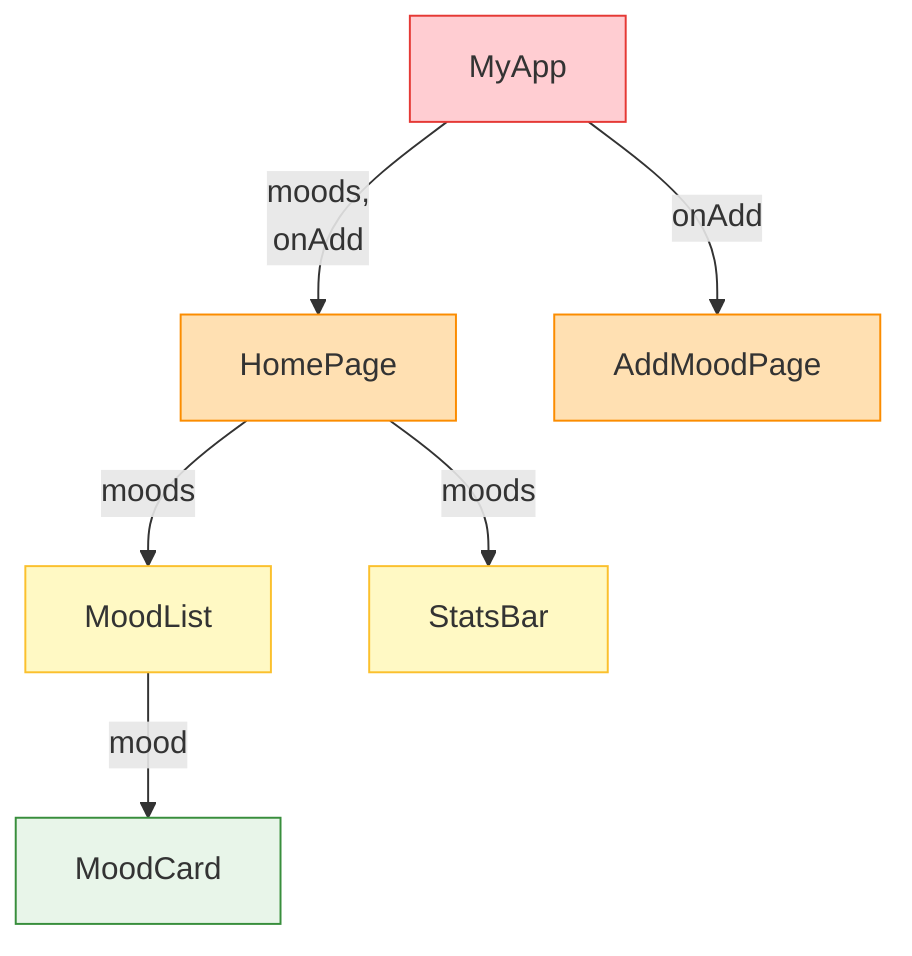
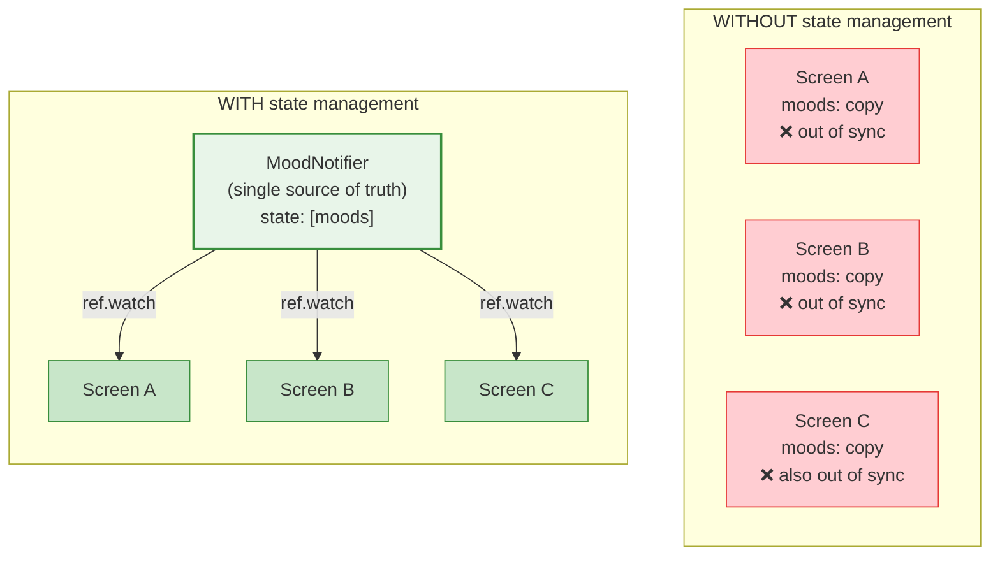
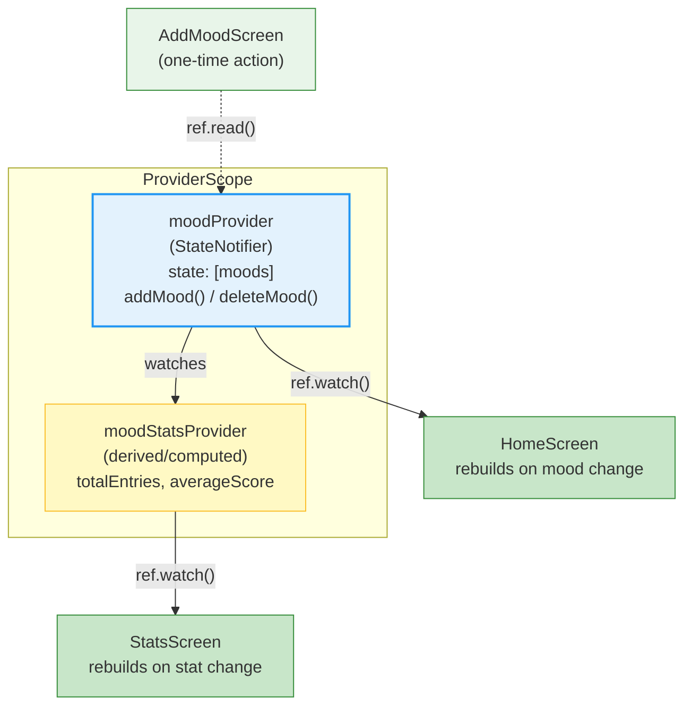
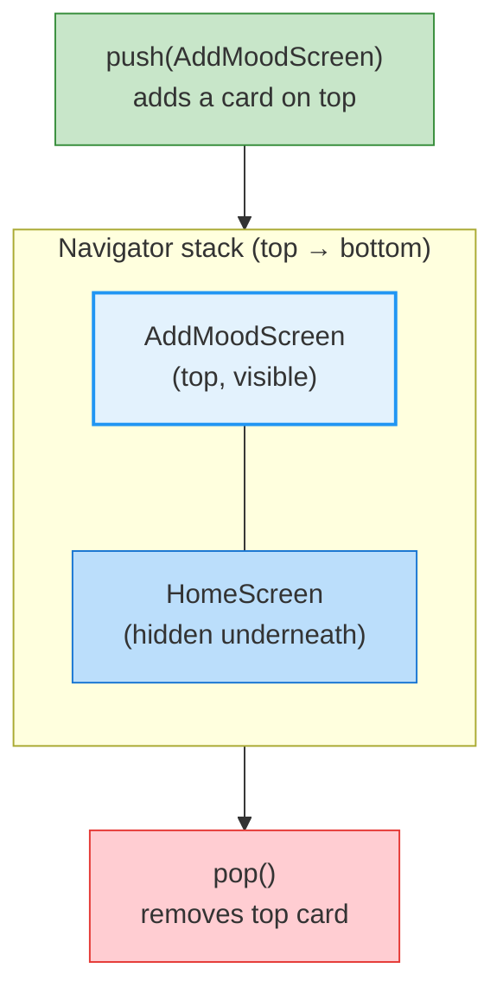
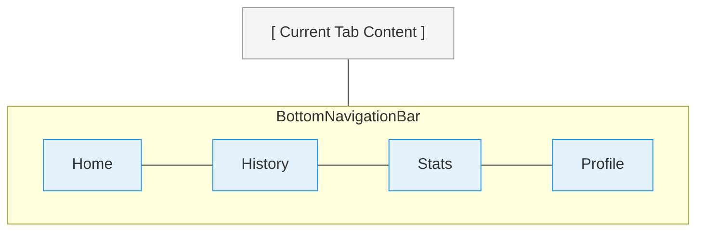
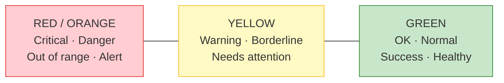

# Week 6 Lecture: Provider/Riverpod, Navigation & User-Centered Design

**Course:** Multiplatform Mobile Software Engineering in Practice
**Duration:** ~2 hours (including Q&A)
**Format:** Student-facing notes with presenter cues

> Lines marked with `> PRESENTER NOTE:` are for the instructor only. Students can
> ignore these or treat them as bonus context.

---

## Table of Contents

1. [The State Management Problem](#1-the-state-management-problem-15-min) (15 min)
2. [State Management Solutions Landscape](#2-state-management-solutions-landscape-15-min) (15 min)
3. [Riverpod Deep Dive](#3-riverpod-deep-dive-25-min) (25 min)
4. [Navigation Patterns in Flutter](#4-navigation-patterns-in-flutter-15-min) (15 min)
5. [User-Centered Design Principles](#5-user-centered-design-principles-15-min) (15 min)
6. [Key Takeaways](#6-key-takeaways-5-min) (5 min)

---

## 1. The State Management Problem (15 min)

### From Hardcoded Data to Shared State

In the lab, you converted from hardcoded data to Riverpod providers. The app looks the same, but now three screens stay in sync automatically. Let's understand why this matters.

State management is one of those topics that sounds academic until you hit the wall. And you will hit the wall -- every Flutter developer does. The question is whether you have the tools to deal with it when it happens.

> PRESENTER NOTE: Ask students: "When you added a mood entry in the lab, did you have
> to manually refresh the home screen to see it? No -- it appeared instantly. That is
> state management at work. Without it, you would need to reload data every time you
> navigated back."

### The Problem: Multiple Screens, Same Data

Consider what happens in a typical app. You have a list screen showing all entries, a detail screen showing one entry, a stats screen showing averages and counts. All three screens need the same underlying data. When the data changes, all three screens need to update.

With `setState()`, you can manage state within a single widget. But `setState()` is **local** -- it only triggers a rebuild of the widget that calls it. There is no built-in mechanism for one widget to tell a completely separate widget that something changed.

### The "Prop Drilling" Nightmare

The naive solution is to pass data down through constructors:



This is called "prop drilling" -- you drill props through every intermediate widget, even if that widget does not need the data itself. It is like passing a note through a chain of people in a crowded room. Everyone in the chain has to handle the note, even if they do not care about its contents.

At small scale, this is manageable. At real-world scale -- a productivity app might have 50+ screens sharing user preferences, project lists, recent activity, and notification state -- prop drilling becomes a maintenance nightmare. Change the shape of your data, and you have to update every widget in the chain.

### The Single Source of Truth

The fundamental principle behind every state management solution is the **single source of truth**: your data should live in exactly one place, and every widget should read from that one place.

Think of a shared document in a collaboration tool. There should be ONE canonical version, not a copy on each user's device that they manually try to keep in sync. When someone edits, every other viewer immediately sees the new version. Nobody calls around asking "did you get the latest copy?" -- the system handles it. That is what state management gives your app.

### Visualizing the Problem



On the left, each screen holds its own copy of the mood list. When Screen A adds a mood entry, Screen B and Screen C have no idea. The data drifts out of sync. On the right, a single `MoodNotifier` holds the truth. Every screen watches it and rebuilds automatically when it changes.

> PRESENTER NOTE: Connect this back to the lab: "You experienced this directly.
> Your MoodNotifier is the single source of truth. HomeScreen, AddMoodScreen, and
> StatsScreen all read from the same provider. Add a mood in one place, see it
> everywhere. That is not magic -- that is architecture."

---

## 2. State Management Solutions Landscape (15 min)

### The Flutter State Management Zoo

Flutter has an unusually large number of state management options. This can feel overwhelming, but it is actually a sign of a healthy ecosystem. Different solutions make different trade-offs, and no single solution is universally best.

Here is a brief tour of the major options:

**setState (built-in, local only)**
The simplest approach. Call `setState()` inside a `StatefulWidget` to trigger a rebuild. Perfect for truly local state -- a checkbox, a text field, an animation. Falls apart when state needs to be shared across widgets.

**InheritedWidget (Flutter primitive, verbose)**
The foundational mechanism Flutter provides for sharing state down the widget tree. Every other solution (except Riverpod) is built on top of this. Powerful but verbose -- you need to write a lot of boilerplate code. You would not typically use this directly in a production app.

**Provider (simplifies InheritedWidget)**
Created by Remi Rousselet, Provider wraps `InheritedWidget` in a clean API. It was the officially recommended state management solution for Flutter for several years. It uses `BuildContext` to locate providers in the widget tree, which introduces some limitations.

**Riverpod (Provider's successor, compile-safe, testable)**
Also by Remi Rousselet, Riverpod is a complete rewrite that solves Provider's limitations. The name is literally an anagram of "Provider." It is independent of the widget tree, compile-safe, and designed for testability.

**BLoC/Cubit (event-driven, more boilerplate)**
Business Logic Component. Separates UI from logic using streams of events and states. Popular in large enterprise apps. More boilerplate than Riverpod, but enforces a very strict architecture. Cubit is a simplified version of BLoC.

**GetX (controversial, magical)**
Does everything -- state management, navigation, dependency injection, HTTP. Very little boilerplate. Controversial because it uses a lot of "magic" (global state, implicit dependencies) that makes debugging harder and testing more difficult.

**Redux (from React world, verbose)**
A well-established pattern from the React ecosystem. Single store, actions, reducers. Very predictable but extremely verbose for Flutter apps. Rarely chosen for new Flutter projects.

**MobX (reactive, annotation-based)**
Uses code generation and annotations. Reactive by nature -- state changes automatically propagate. Less popular in Flutter than in the JavaScript world.

### Why Riverpod for This Course

We chose Riverpod for several reasons:

1. **Compile-safe:** Errors are caught at build time, not at runtime. If you mistype a provider name or use the wrong type, the compiler tells you before you even run the app.

2. **Independent of the widget tree:** Unlike Provider, Riverpod providers do not live inside the widget tree. This means you can access any provider from anywhere without needing a `BuildContext`. This makes testing dramatically easier.

3. **Easy to test:** You can create a `ProviderContainer` in a unit test and verify your state logic without ever building a widget. In any non-trivial app — where correctness matters and bugs are expensive — testability is not optional.

4. **Growing ecosystem:** Riverpod has strong community support and is the direction the Flutter ecosystem is heading. Learning it now prepares you for the industry.

5. **Clear patterns:** The distinction between `ref.watch()` and `ref.read()` makes it obvious when and why your UI rebuilds. This clarity matters when debugging performance issues in complex apps.

### Provider vs Riverpod: A Quick Comparison

| Aspect | Provider | Riverpod |
|---|---|---|
| Depends on BuildContext | Yes | No |
| Built on InheritedWidget | Yes | No |
| Two providers of same type | Not possible | Supported |
| Compile-safe | Partially | Fully |
| Provider overrides for testing | Limited | First-class |
| Provider dependencies | Implicit | Explicit |
| Learning curve | Lower | Slightly higher |

> PRESENTER NOTE: Don't spend too long on alternatives. Students should know they exist
> but focus on Riverpod. If students ask "which is best?", the answer is "there's no
> universal best -- Riverpod is a strong modern choice, and the concepts transfer to
> other solutions." If someone on the team already knows BLoC or another approach, that
> is fine -- the architectural thinking is the same.

---

## 3. Riverpod Deep Dive (25 min)

### Provider Types: Picking the Right Tool

Riverpod offers several provider types, each designed for a specific use case. Choosing the right one is like choosing the right tool from a workshop -- you could technically use a hammer for everything, but a screwdriver works much better for screws.

**Provider -- Read-only computed values**
Returns a value that cannot be modified directly. Perfect for derived or computed data. In the lab, `moodStatsProvider` is a `Provider` that computes statistics from the mood list. It does not hold its own state -- it derives its value from another provider.

```dart
final moodStatsProvider = Provider<MoodStats>((ref) {
  final moods = ref.watch(moodProvider);
  return MoodStats(
    totalEntries: moods.length,
    averageScore: moods.isEmpty ? 0 : moods.map((m) => m.score).average,
  );
});
```

**StateNotifierProvider -- Mutable state with methods**
The workhorse of Riverpod. Pairs a `StateNotifier` class (which holds state and exposes methods to modify it) with a provider. In the lab, `moodProvider` uses this pattern. The `MoodNotifier` class has `addMood()` and `deleteMood()` methods that modify the mood list.

```dart
final moodProvider = StateNotifierProvider<MoodNotifier, List<MoodEntry>>((ref) {
  return MoodNotifier();
});
```

**FutureProvider -- Async data loading**
Returns a `Future` and automatically handles loading/error/data states. Ideal for one-time async operations like fetching a user profile or a list of items from a backend.

```dart
final userProfileProvider = FutureProvider<UserProfile>((ref) async {
  final response = await api.getProfile(id: currentUserId);
  return UserProfile.fromJson(response);
});
```

**StreamProvider -- Real-time data streams**
Wraps a `Stream` and rebuilds widgets whenever a new value arrives. Perfect for real-time data -- live notifications, WebSocket connections, position updates from a sensor, or any continuously changing source.

```dart
final notificationsProvider = StreamProvider<List<Notification>>((ref) {
  return notificationService.stream;
});
```

**StateProvider -- Simple mutable state**
A lightweight alternative to `StateNotifierProvider` for trivially simple state -- a counter, a toggle, a selected tab index. If your state logic has more than one or two operations, reach for `StateNotifierProvider` instead.

```dart
final selectedTabProvider = StateProvider<int>((ref) => 0);
```

> PRESENTER NOTE: Emphasize that students already used two of these in the lab:
> StateNotifierProvider for moodProvider and Provider for moodStatsProvider.
> The others become relevant as the app grows. Don't worry about memorizing all
> five -- the documentation is excellent, and the compiler will guide you.

### The ref Object: watch() vs read()

The `ref` object is your gateway to the Riverpod universe. It has two primary methods, and understanding when to use each is one of the most important things in this lecture.

**ref.watch() -- Rebuilds when data changes**
Use inside `build()` methods. It subscribes the widget to the provider. Whenever the provider's value changes, the widget rebuilds with the new data.

```dart
Widget build(BuildContext context, WidgetRef ref) {
  final moods = ref.watch(moodProvider);  // Rebuilds when moods change
  return ListView(children: moods.map((m) => MoodCard(m)).toList());
}
```

**ref.read() -- One-time access, no subscription**
Use inside callbacks, event handlers, and `onPressed` functions. It reads the current value without subscribing. The widget will NOT rebuild when the value changes.

```dart
ElevatedButton(
  onPressed: () {
    ref.read(moodProvider.notifier).addMood(newMood);  // One-time action
  },
  child: Text('Save'),
)
```

In the lab, you used `ref.watch(moodProvider)` in HomeScreen's `build` method and `ref.read(moodProvider.notifier)` in AddMoodScreen's submit button. That distinction is crucial.

**The rule of thumb:** If you are **displaying** data, use `ref.watch()`. If you are **performing an action**, use `ref.read()`.

Why not always use `ref.watch()`? Because subscribing inside a callback would mean the callback re-registers every time the data changes, potentially causing unnecessary rebuilds, memory leaks, or unexpected behavior. The callback only needs to read the current value at the moment it fires.

> PRESENTER NOTE: A common student mistake is using ref.watch() inside onPressed.
> If you see this in code reviews, gently explain why ref.read() is correct there.
> It won't necessarily crash, but it breaks the reactive model and can cause subtle
> bugs as the app grows.

### Immutable State Updates: The Photograph Analogy

When you modify state in a `StateNotifier`, you must replace the entire state object rather than mutating it in place.

**Wrong:**
```dart
void addMood(MoodEntry entry) {
  state.add(entry);  // Mutates the existing list -- Riverpod won't detect the change!
}
```

**Right:**
```dart
void addMood(MoodEntry entry) {
  state = [...state, entry];  // Creates a new list -- Riverpod detects the change
}
```

Why? `StateNotifier` compares the old and new state by **reference**, not by content. If you mutate the existing list, the reference stays the same, and Riverpod thinks nothing changed. No rebuild happens. Your UI stays stale.

**Analogy:** Think of replacing a photograph versus drawing on it. If you draw on the same photo, nobody notices the change -- the photo is still the same object. If you hand someone a completely new photo, they immediately see it is different. Riverpod works the same way: it only reacts when it receives a new object, not when an existing object is modified internally.

This principle -- immutable state updates -- is not unique to Riverpod. It appears in Redux, BLoC, SwiftUI, Jetpack Compose, and nearly every modern reactive framework. Learn it once, apply it everywhere.

### Provider Dependencies: Reactive Chains

One of Riverpod's most powerful features is that providers can depend on other providers.

In the lab, `moodStatsProvider` watches `moodProvider`. When a mood is added, the mood list changes. Because `moodStatsProvider` watches the mood list, it automatically recalculates statistics. The `StatsScreen`, which watches `moodStatsProvider`, automatically rebuilds with updated numbers.

Nobody has to orchestrate this. Nobody has to call "refreshStats" manually. The dependency chain handles it.

```mermaid
graph TD
    Action['User taps "Add Mood"'] --> Notifier["MoodNotifier.addMood()"]
    Notifier --> NewState["moodProvider state changes<br/>(new list)"]
    NewState --> Home["HomeScreen rebuilds<br/>(ref.watch(moodProvider))"]
    NewState --> StatsProv["moodStatsProvider recalculates"]
    StatsProv --> StatsScreen["StatsScreen rebuilds<br/>(ref.watch(moodStatsProvider))"]
    style Action fill:#E3F2FD,stroke:#2196f3,stroke-width:2px
    style Notifier fill:#BBDEFB,stroke:#1976d2
    style NewState fill:#FFF9C4,stroke:#fbc02d
    style Home fill:#E8F5E9,stroke:#388e3c
    style StatsProv fill:#FFE0B2,stroke:#fb8c00
    style StatsScreen fill:#E8F5E9,stroke:#388e3c
```

This is **reactive programming** -- data flows downhill automatically. You declare dependencies, and the system handles propagation.

### The Riverpod Data Flow



The `ProviderScope` at the top of your widget tree is the container that holds all provider state. Inside it, `moodProvider` holds the authoritative mood list. `moodStatsProvider` derives from it. Screens either watch (for reactive display) or read (for one-time actions).

### A Real-World Reactive Architecture

Consider a typical productivity app — say, a team-collaboration tool that combines tasks, notifications, and presence:

- A `tasksProvider` (StateNotifierProvider) that holds the active task list
- A `currentUserProvider` (FutureProvider) that loads the user's profile and team membership
- A `notificationsProvider` (StreamProvider) that streams new notifications from the backend
- A `tasksDueTodayProvider` (Provider) that derives from both — combining tasks with the current date and the user's timezone to compute "what's due today"

When a teammate completes a task, the backend pushes an update to the stream. The tasks provider receives the new state, the derived "due today" provider re-evaluates, and every screen that watches it (the home dashboard, the badge counter on the icon, the daily summary card) updates simultaneously — all without a single line of manual orchestration. Riverpod's dependency system handles this elegantly, and the reactive chain is easy to test in isolation.

### Testing with Riverpod

Testability is where Riverpod truly shines compared to alternatives that depend on `BuildContext`.

**Unit testing state logic:**
```dart
test('addMood increases list length', () {
  final container = ProviderContainer();
  final notifier = container.read(moodProvider.notifier);

  notifier.addMood(MoodEntry(score: 4, note: 'Good day'));

  expect(container.read(moodProvider).length, 1);
});
```

**Widget testing with overrides:**
```dart
testWidgets('HomeScreen shows moods', (tester) async {
  await tester.pumpWidget(
    ProviderScope(
      overrides: [
        moodProvider.overrideWith((ref) => MoodNotifier()..addMood(testMood)),
      ],
      child: MaterialApp(home: HomeScreen()),
    ),
  );

  expect(find.text('Good day'), findsOneWidget);
});
```

You can override any provider with test data. No mocking frameworks, no dependency injection containers, no test-only subclasses. This is why teams that take testing seriously gravitate toward Riverpod.

> PRESENTER NOTE: If time permits, open the lab code and walk through the finished
> implementation. Highlight the architectural decisions: why StateNotifier instead of
> simple StateProvider (because the mood list needs methods like addMood and deleteMood),
> why derived state for stats (because stats are computed from moods, not stored
> independently), why ref.watch in build but ref.read in callbacks (reactive display
> vs one-time action).

---

## 4. Navigation Patterns in Flutter (15 min)

### How Users Move Through Your App

Navigation is how users move from one screen to another. It sounds simple, but the navigation architecture of your app shapes the entire user experience. A poorly navigated app feels confusing and frustrating. A well-navigated app feels invisible -- users get where they need to go without thinking about it.

### Navigator 1.0: The Imperative Approach

Flutter's original navigation model is imperative -- you explicitly push and pop screens onto a stack, like a deck of cards:

```dart
// Push a new screen onto the stack
Navigator.push(context, MaterialPageRoute(builder: (_) => DetailScreen()));

// Pop the current screen off the stack
Navigator.pop(context);
```

This is what you used in the lab to navigate between HomeScreen, AddMoodScreen, and StatsScreen. It is straightforward and sufficient for most mobile app needs.

**Mental model -- a stack of cards:**



### Navigator 2.0: The Declarative Approach

Flutter also offers a declarative navigation model (Navigator 2.0 / Router) that defines navigation state as data. The URL bar and the app state stay synchronized. This is essential for:

- **Web apps** where users expect URLs to reflect the current page
- **Deep linking** where a push notification takes you directly to a specific screen
- **Complex flows** where navigation depends on authentication state, onboarding completion, etc.

For this course, Navigator 1.0 is sufficient. We mention Navigator 2.0 so you know it exists when you need it.

> PRESENTER NOTE: If students ask about go_router or auto_route, briefly acknowledge
> these packages as popular wrappers around Navigator 2.0 that simplify declarative
> routing. We won't use them in this course, but they are worth exploring for
> production apps.

### Common Navigation Patterns

**Stack navigation (push/pop)**
The default. Used for drill-down flows: tap an item in a list, see the detail screen, tap back to return. You used this in the lab.

**Tab navigation (BottomNavigationBar)**
Used for main app sections that are equally important and frequently accessed. Many productivity and content apps use this: a home tab, a history/log tab, a profile tab.



**Drawer navigation (side menu)**
Used for secondary features: settings, help, about, logout. Accessed by tapping a hamburger menu icon or swiping from the edge of the screen.

**Modal bottom sheets**
Used for quick actions that do not warrant a full screen: selecting a filter, confirming a deletion, choosing from a short list of options.

### Passing Data Between Screens

When navigating, you often need to pass data to the destination screen:

```dart
// Pass data via constructor
Navigator.push(
  context,
  MaterialPageRoute(
    builder: (_) => MoodDetailScreen(moodEntry: selectedMood),
  ),
);
```

With Riverpod, you have another option: the destination screen can read from a provider instead of receiving data through its constructor. This reduces coupling between screens and avoids deep constructor chains.

```dart
// Instead of passing data directly, the detail screen reads from a provider
class MoodDetailScreen extends ConsumerWidget {
  final String moodId;
  MoodDetailScreen({required this.moodId});

  Widget build(BuildContext context, WidgetRef ref) {
    final mood = ref.watch(moodByIdProvider(moodId));
    // ...
  }
}
```

Both approaches are valid. Use constructors for simple cases and providers when the data is already managed by your state layer.

### Navigation and Your Users' Mental Model

A power user switching between many records needs fast navigation -- tabs, search, recents. Every extra tap adds friction to a workflow they perform dozens of times a day.

A first-time or occasional user needs a simple, linear flow -- step one, step two, done. Complexity and choice create cognitive load for someone unfamiliar with the app.

Choose navigation patterns based on your user. Do not impose a power-user workflow on a first-timer, or vice versa.

> PRESENTER NOTE: If possible, show screenshots from popular apps. Most productivity apps
> use tab navigation for main sections and push navigation for details. Many use a
> prominent "+" button or floating action button to minimize the steps to the most
> common write action. These are deliberate UX decisions, not accidents.

---

## 5. User-Centered Design Principles (15 min)

### Why UX Determines Whether Your App Survives

You are building a real app that real people will try. Most users are not a 25-year-old developer at their desk -- they are stressed, multitasking, on a slow connection, or distracted. A confusing app annoys them; a clear app delights them.

UX matters more than most students realize. A widely cited industry stat: **77% of mobile apps are abandoned within three days of installation**, and the top reason is poor onboarding and confusing flows. Good UX is not a polish step at the end. It determines whether users stick around long enough to discover your features at all.

### Key Principles

**1. Clarity: Use plain language**
Write labels, instructions, and messages in language your user understands. "Your daily streak ended" is better than "Cycle interruption detected." Use the words your user uses, not the words your engineers use.

**2. Simplicity: Minimize steps**
Every tap, swipe, and decision is cognitive load. Count the steps it takes to complete the most common task in your app. Then see if you can remove one. In the lab, adding a mood entry takes three steps: tap the add button, fill in the form, tap save. That is about right for a logging action.

**3. Feedback: Confirm actions**
When a user saves data, show confirmation: "Entry saved." When syncing to a server, show progress. When an error occurs, explain what happened and what to do next. Silence breeds uncertainty, and uncertainty breeds anxiety.

**4. Error prevention: Make it hard to do the wrong thing**
Disable the submit button until required fields are filled. Use date pickers instead of free-text date entry. Validate inputs as the user types. It is always better to prevent an error than to display an error message after the fact.

**5. Accessibility: Design for everyone**
WCAG 2.1 compliance is not a checkbox exercise -- it is a commitment to inclusivity.

- **Screen reader support:** Every interactive element needs a semantic label
- **Sufficient contrast:** At least 4.5:1 for normal text, 3:1 for large text
- **Touch targets:** Minimum 48x48 dp (Material Design standard) -- users with motor impairments, users tapping one-handed on a moving bus, and older users need generous tap areas
- **Typography:** Minimum 16sp for body text -- if your user cannot read the instructions, the app is useless regardless of how good the features are

**6. Trust: Be transparent about data**
Users share data with you -- their habits, notes, plans, contacts. The app must feel trustworthy. Explain what data you collect, how it is stored, and who can access it. Show privacy controls prominently. A user who does not trust your app will not use it, no matter how well-designed the UI is.

### The 5-Second Test

Can a new user understand what a screen does within 5 seconds of seeing it? If not, the screen is too complex.

Show your screen to someone who has never seen it. After 5 seconds, take it away and ask: "What was that screen for?" If they cannot answer confidently, simplify.

This test is especially important for apps where users may be distracted, multitasking, or new to the product. They do not have the cognitive bandwidth to decode a cluttered interface.

### Color Carries Meaning

Color carries strong semantic meaning that users learn very early in life:



These associations are deeply ingrained. If you use green for an error message or red for a confirmation, you will confuse and alarm your users.

**Important caveat:** Do not use color as the ONLY indicator. Approximately 8% of men and 0.5% of women have some form of color vision deficiency. Always pair color with text, icons, or patterns.

```
Good:    [!] Error: Score must be 1–10  (red background + icon + text)
Bad:     Score must be 1–10              (red text only)
```

### Typography and Touch Targets

Two often-overlooked details that make or break app usability:

**Typography:** The default Flutter text size (14sp) is too small for many users. Set body text to at least 16sp. For apps targeting older audiences, consider 18sp or even 20sp. Headers and labels should scale proportionally.

**Touch targets:** The Material Design minimum of 48x48 dp applies to every tappable element: buttons, list items, checkboxes, icons. If your "delete" button is 24x24 pixels, a user tapping one-handed on a crowded subway will struggle to hit it accurately. Inaccessible UI is not just bad design -- it is a barrier.

> PRESENTER NOTE: Show a "bad" mobile UI (cluttered, small text, poor contrast) next to a
> "good" one (clean, readable, accessible). Ask students to identify the differences.
> This exercise is memorable and directly applicable to their projects.
> If you don't have real examples, mock up two versions of a mood tracker screen --
> one with 12sp text and tiny buttons, another with 16sp text and generous spacing.
> The contrast is striking.

### UX Is a Product Outcome

Good UX is not a polish step -- it is the most direct lever you have on whether users come back. App store ratings, retention curves, and conversion rates are mostly downstream of UX decisions. A confusing onboarding flow loses 60% of users in the first session. A great onboarding flow keeps them.

When you design your app, you are not just designing software. You are designing the *experience* of using it. Treat the UX with the same rigor you would treat your code.

!!! tip "Reference: Accessibility Quick Guide"
    For concrete code examples implementing semantic labels, contrast checks, scalable text, and proper touch targets in Flutter, see the [Accessibility Guide](../../resources/ACCESSIBILITY_GUIDE.md). Apply these patterns to your team project — they are graded as part of the Industry & Regulatory Awareness rubric (15 points in the final project).

---

## 6. Key Takeaways (5 min)

1. **State management solves the cross-screen data synchronization problem** -- a single source of truth replaces scattered copies that drift out of sync.

2. **Riverpod provides compile-safe, testable, reactive state management** with clear patterns: `ref.watch()` for reactive display, `ref.read()` for one-time actions.

3. **Immutable state updates ensure that changes are always detected and propagated** -- replace the entire state object, do not mutate it in place.

4. **Navigation patterns should match your user's mental model** -- some users need simplicity and linear flows, power users need speed and direct access.

5. **User-centered design requires extra care** -- accessibility, clarity, trust, and error prevention are not optional features; they are core requirements.

6. **The patterns you learned in the lab scale to production apps** -- ConsumerWidget, ref.watch, StateNotifier, and derived providers are the same building blocks used in professional Flutter applications.

---

## Further Reading

If you want to go deeper on any topic covered today:

- **Riverpod documentation:** [https://riverpod.dev/](https://riverpod.dev/)
- **Flutter state management guide:** [https://docs.flutter.dev/data-and-backend/state-mgmt](https://docs.flutter.dev/data-and-backend/state-mgmt)
- **Flutter navigation and routing:** [https://docs.flutter.dev/ui/navigation](https://docs.flutter.dev/ui/navigation)
- **Material Design accessibility:** [https://m3.material.io/foundations/accessible-design](https://m3.material.io/foundations/accessible-design)
- **Mobile UX research summary (NN/g):** [https://www.nngroup.com/articles/mobile-ux/](https://www.nngroup.com/articles/mobile-ux/)
- **WCAG 2.1 guidelines:** [https://www.w3.org/TR/WCAG21/](https://www.w3.org/TR/WCAG21/)
